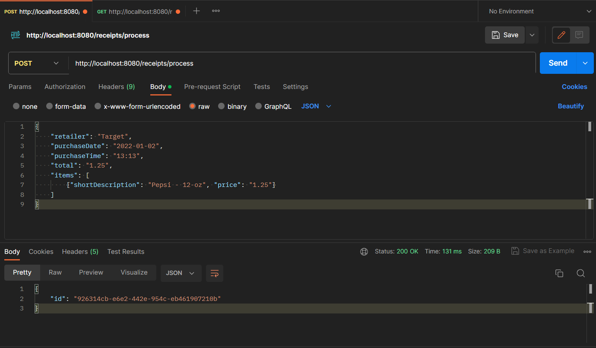
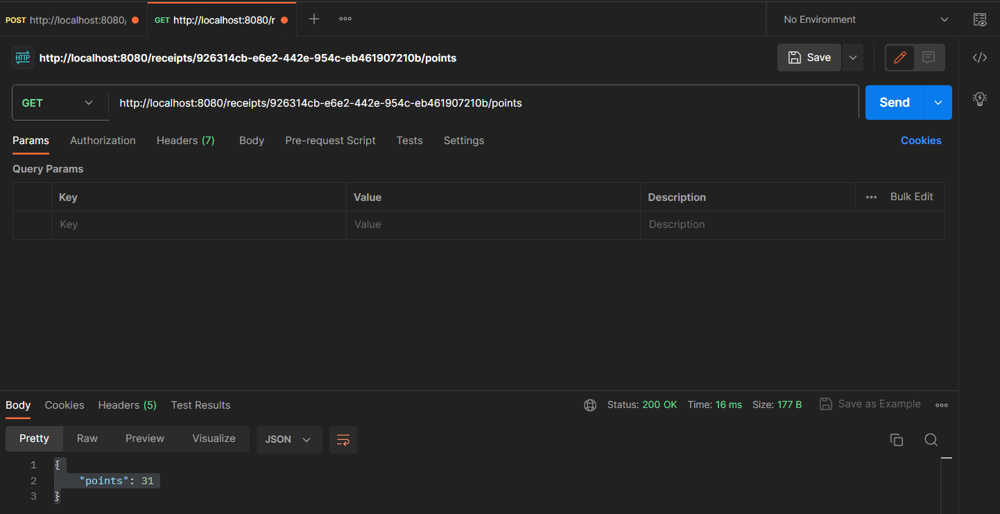

# Receipt Processor

Build a web service that fulfils the documented API. The API is described below after the instructions to run the application. A formal definition is also provided in the [api.yml](./api.yml) file

## Instructions to run the application

### Requirements
- Docker
- Unzip the file OR Clone the repo on your local machine from GitHub using the link provided below:

        git clone https://github.com/SidhantBansal18/receipt-processor-challenge.git


### Steps

1. CD into the cloned repo directory
2. Launch the Docker client or the Docker desktop application
3. Build the image

        docker build --platform linux/amd64 -t spring-receipt-processor-challenger .

4. Run the backend application 

        docker run -p 8080:8080 -t spring-receipt-processor-challenger

5. The server will start on `http://localhost:8080`

---

### Testing the application

1. Using Postman
    1. Process a receipt
       1. Open a workspace in Postman
       2. Select the request type as "POST"
       3. Put the URL as `http://localhost:8080/receipts/process`
       4. Click on "Body"
       5. Clik on "raw"
       6. Select "JSON" from the dropdown
       7. Paste this in the text field
          {
          "retailer": "Target",
          "purchaseDate": "2022-01-02",
          "purchaseTime": "13:13",
          "total": "1.25",
          "items": [
          {"shortDescription": "Pepsi - 12-oz", "price": "1.25"}
          ]
          }
       8. Hit "Send"
       9. Example Response:
          {
          "id": "926314cb-e6e2-442e-954c-eb461907210b"
          }
   
   
       
    2. Get receipt points
       1. Add a tab for another request in the postman workspace
       2. Select the request type as "GET"
       3. Put the URL as `http://localhost:8080/receipts/926314cb-e6e2-442e-954c-eb461907210b/points`
       4. Hit "Send"
       5. Example Response:
          {
          "points": 31
          }
          



## Summary of API Specification

### Endpoint: Process Receipts

* Path: `/receipts/process`
* Method: `POST`
* Payload: Receipt JSON
* Response: JSON containing an id for the receipt.

Description:

Takes in a JSON receipt (see example in the example directory) and returns a JSON object with an ID generated by your code.

The ID returned is the ID that should be passed into `/receipts/{id}/points` to get the number of points the receipt
was awarded.

How many points should be earned are defined by the rules below.

Example Response:
```json
{ "id": "7fb1377b-b223-49d9-a31a-5a02701dd310" }
```

## Endpoint: Get Points

* Path: `/receipts/{id}/points`
* Method: `GET`
* Response: A JSON object containing the number of points awarded.

A simple Getter endpoint that looks up the receipt by the ID and returns an object specifying the points awarded.

Example Response:
```json
{ "points": 32 }
```

---

# Rules

These rules collectively define how many points should be awarded to a receipt.

* One point for every alphanumeric character in the retailer name.
* 50 points if the total is a round dollar amount with no cents.
* 25 points if the total is a multiple of `0.25`.
* 5 points for every two items on the receipt.
* If the trimmed length of the item description is a multiple of 3, multiply the price by `0.2` and round up to the nearest integer. The result is the number of points earned.
* 6 points if the day in the purchase date is odd.
* 10 points if the time of purchase is after 2:00pm and before 4:00pm.


## Examples

```json
{
  "retailer": "Target",
  "purchaseDate": "2022-01-01",
  "purchaseTime": "13:01",
  "items": [
    {
      "shortDescription": "Mountain Dew 12PK",
      "price": "6.49"
    },{
      "shortDescription": "Emils Cheese Pizza",
      "price": "12.25"
    },{
      "shortDescription": "Knorr Creamy Chicken",
      "price": "1.26"
    },{
      "shortDescription": "Doritos Nacho Cheese",
      "price": "3.35"
    },{
      "shortDescription": "   Klarbrunn 12-PK 12 FL OZ  ",
      "price": "12.00"
    }
  ],
  "total": "35.35"
}
```
```text
Total Points: 28
Breakdown:
     6 points - retailer name has 6 characters
    10 points - 4 items (2 pairs @ 5 points each)
     3 Points - "Emils Cheese Pizza" is 18 characters (a multiple of 3)
                item price of 12.25 * 0.2 = 2.45, rounded up is 3 points
     3 Points - "Klarbrunn 12-PK 12 FL OZ" is 24 characters (a multiple of 3)
                item price of 12.00 * 0.2 = 2.4, rounded up is 3 points
     6 points - purchase day is odd
  + ---------
  = 28 points
```

----

```json
{
  "retailer": "M&M Corner Market",
  "purchaseDate": "2022-03-20",
  "purchaseTime": "14:33",
  "items": [
    {
      "shortDescription": "Gatorade",
      "price": "2.25"
    },{
      "shortDescription": "Gatorade",
      "price": "2.25"
    },{
      "shortDescription": "Gatorade",
      "price": "2.25"
    },{
      "shortDescription": "Gatorade",
      "price": "2.25"
    }
  ],
  "total": "9.00"
}
```
```text
Total Points: 109
Breakdown:
    50 points - total is a round dollar amount
    25 points - total is a multiple of 0.25
    14 points - retailer name (M&M Corner Market) has 14 alphanumeric characters
                note: '&' is not alphanumeric
    10 points - 2:33pm is between 2:00pm and 4:00pm
    10 points - 4 items (2 pairs @ 5 points each)
  + ---------
  = 109 points
```

---
